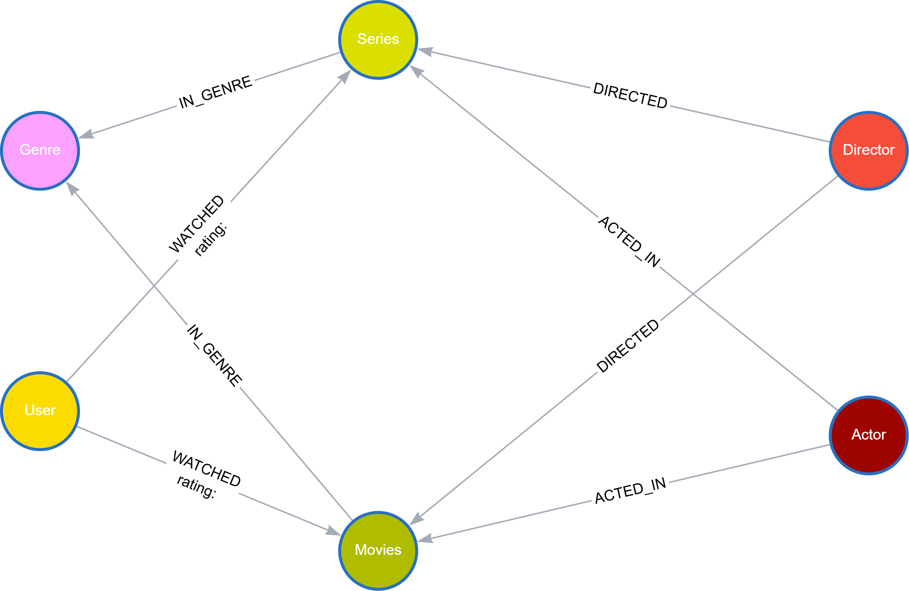
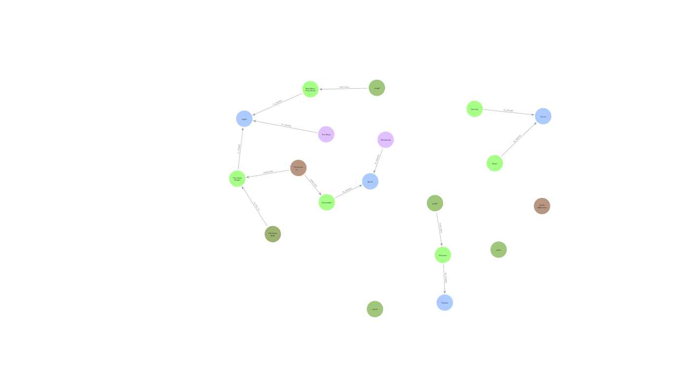

# Projeto de Modelagem de Dados em Grafos para um Serviço de Streaming

Projeto desenvolvido com o objetivo de estruturar um banco de dados orientado a grafos para um serviço de streaming de filmes e séries, permitindo explorar relações complexas entre usuários, conteúdos e interações.

## 📌 Etapas do Projeto

- Análise inicial do caso e definição do escopo  
- Criação do esboço do Grafo de Conhecimento (*Knowledge Graph*)  
- Estudos complementares sobre **constraints** para garantir integridade dos dados  
- Estudos e prática de comandos **UNWIND** para inserção eficiente de dados no grafo

Resultado do escopo inicial:

  

## 🛠️ Instruções de Execução

Importe no **Neo4j** o arquivo `script_modelagem.cypher` disponível no repositório.

Executando esse arquivo no neo4js vai em explorer aparecer esse resultado de grafo:

  

## 🧰 Tecnologias Utilizadas

- [Neo4j](https://neo4j.com/)
